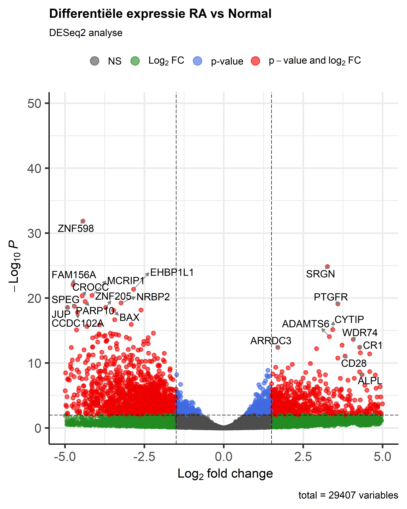

# Transcriptomics-project-Reuma
Project Reuma vs Controle

**help hoe en waar moet ik de resultaten bestanden en scripts neerzetten** **STUKJE OVER GEKOZEN PATHWAY, AI DISCLAIMER TOEVOEGEN**

## 📁 Introductie 
Reumatoïde artritis (RA) is een chronische, systematische auto-immuunziekte waarbij het immuunsysteem het eigen gewrichtsweefsel aanvalt. De exacte oorzaak is nog niet volledig bekend, maar een combinatie van genetische factoren, omgevingsinvloeden en een ontregelde immuunrespons speelt een belangrijke rol. Een kenmerkend aspect van RA is synovitis: een ontsteking van het gewrichtsslijmvlies die leidt tot pijn, zwelling en uiteindelijk gewrichtsschade. Vroege diagnose en inzicht in de onderliggende moleculaire processen zijn essentieel om progressie te beperken. 

In dit project is een transcriptomics-analyse uitgevoerd op RNA-seq data afkomstig uit synoviumbiopten van vier gezonde personen en vier personen met vastgestelde RA (>12 maanden, ACPA-positief). Door middel van bio-informatische analyse worden verschillen in genexpressie onderzocht tussen beide groepen. Het doel is om inzicht te krijgen in welke genen en biologische processen veranderen bij RA en welke pathways mogelijk betrokken zijn bij de ziekte. De uitkomsten laten zien welke processen in het lichaam anders werken bij reuma, dat geeft meer inzicht in de ziekte en kan helpen bij het zoeken naar nieuwe medicijnen. 
___

## 🔬 Methode
De analyse is uitgevoerd in R, waarbij alle onderdelen van de RNA-seq analyse stap voor stap zijn verwerkt. De ruwe RNA‑seq data die in dit project is gebruikt, is afkomstig uit het artikel van Platzer et al. (2019). Het volledige artikel staat in de GitHub‑repository in de map bronnen. De ruwe FASTQ-bestanden zijn gemapt op het humane referentiegenoom **GRCh38 (GCF_000001405.40_GRCh38.p14)**. Hiervoor is het pakket **Rsubread** gebruikt. Eerst is een index ingebouwd, waarna alle reads van de acht samples zijn uitgelijnd. De resulterende BAM-bestanden zijn gesorteerd en geïndexeerd met **Rsamtools**.

Vervolgens zijn gen-tellingen gegenereerd met **featureCounts**, waarbij gebruik gemaakt is van een bijbehorend **genomic.gtf**-annotatiebestand. De count matrix is gebruikt als input voor **DESeq2**, waarmee differntiële genexpressie tussen RA en gezonde controles is bepaald. Hierbij is een model gebruikt met de factor *treatment* (Normal vs RA).

Na de DESeq2-analyse zijn significante genen geselecteerd op basis van padj <0.05 en |log2FC| >1. Om te zien welke processen in het lichaam anders werken, is er een GO-analyse gedaan. Daarbij is ervoor gezorgd dat langere en kortere genen eerlijk met elkaar vergeleken worden. Daarnaast is er een KEGG-analyse uitgevoerd om betrokken signaalroutes te identificeren.  
___

## 📊 Resultaten
De DESeq2-analyse identificeerde 4572 differentieel tot expressie komende genen (DEGs) tussen RA en gezond, waarvan 2085 verhoogd en 2487 verlaagd. Opvallende genen zoals **BAX**, **BCL2A1**, **SRGN**, **CD28**, **ALPL** en **ADAMTS6** lieten sterke regulatie zien, passend bij apoptose, immuunactivatie en ontstekingsprocessen. In figuur 1 visualiseert de vulcano plot deze veranderingen op basis van log₂ fold change en −log₁₀ p waarde.

<table>
  <tr>
    <td align="center">
       
      <b>Figuur 1.</b> Volcano plot van de DESeq2-analyse.
    </td>
    <td align="center">
       
      <b>Figuur 2.</b> GO-enrichment dotplot.
    </td>
  </tr>
</table>

___

## 🧠 Conclusie
Deze transcriptomics-analyse laat dat reuma zorgt voor grote veranderingen in hoe genen zich gedragen in het gewricht. De sterke toename van genen die betrokken zijn bij ontsteking, cytokinesignalering en immuunactivatie wijst op een hyperactieve immuunrespons in RA-weefsel. Daarnaast toont de resultaten afwijkingen in apoptose-gerelateerde genen en extracellulaire matrixprocessen, wat aansluit bij de weefselremodellering en gewrichtsschade die kenmerkend zijn voor RA.

De verrijkte GO-termen en KEGG-pathways bevestigen dat vooral **TNF-, NF-kB-** en **cytokinesignalering** een centrale rol spelen in de ziekte. Deze bevindingen sluiten aan bij bestaande kennis over RA en ondersteunen het gebruik van therapieën die gericht zijn op cytokineremming (zoals anti-TNF-medicatie). De resultaten bieden daarnaast informatie voor verder onderzoek naar nieuwe biomarkter en therapeutische targets. 
